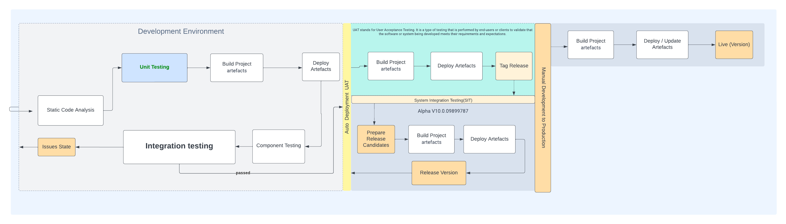

# Table of Contents  
1.0.    [Overview](#Overview)  
&nbsp;&nbsp;&nbsp;&nbsp;1.1.0   [Pipeline Diagram](#PipelineDiagram)

2.0.    [Purpose Of Gateway Service](#PurposeOfService)  
3.0.    [The Endpoints Description](#EndpointDescription)  
&nbsp;&nbsp;&nbsp;&nbsp;3.1.    [Create Connection Gateway API](#ConnectionGateWayAPI)  
&nbsp;&nbsp;&nbsp;&nbsp;3.2.    [Calling A Function/Procedure Gateway Endpoint](#CallSQLProcedureGatewayAPI)  
4.0     [Installation](#Installation)  
&nbsp;&nbsp;&nbsp;&nbsp; 4.1    [Git Clone Repository](#CloneRepository)  
&nbsp;&nbsp;&nbsp;&nbsp; 4.2    [Start Server](#CloseStartServer)  
5.0     [Documentations](#Documentations)  
6.0     [Collaborators](#Collaborators)


<a name="Overview"/>

## Overview
The API gateway service provides an HTTP/TCP endpoint access to an underline Postgres server. Furthermore, it helps Postgres users to avoid the use of SQL query languages directly.  The favoured standard ways to access databases tables, views, and system objects in Postgres. Is via store procedures/functions.

<a name="PipelineDiagram"/>

### Delivering Pipeline 
 

<a name="PurposeOfService">

## Purpose Of Gate Service
This service aims to provide a single endpoint API using JSON format messaging protocol to access the Postgres procedures/functions.

Using SQL procedures to write records to a database can offer several advantages over writing SQL statements directly in your code:

- Modularity: By using SQL procedures, you can separate the database logic from the application logic, making it easier to manage and maintain your code.

- Security: SQL procedures can help to improve the security of your application by providing an additional layer of protection against SQL injection attacks.

- Performance: SQL procedures can be compiled and optimized by the database server, which can result in improved performance compared to running the same SQL statements directly in your code.

- Reusability: SQL procedures can be reused across multiple applications and projects, making it easier to standardize your database access code.

Overall, using SQL procedures can help to improve the reliability, security, and performance of your application, while also making it easier to manage and maintain your code.


## Environment Variables
  The following environment variable is need to run the application

  ```bash
   export DATABASE_NAME     =<required>
   export DATABASE_USERNAME =<required>
   export DATABASE_PASSWORD =<required>
   export DB_PORT=<required>
   export DB_HOST=<required>
  ```

<a name="EndpointDescription"/>


## The Endpoints Description
The following are the TCP/HTTP endpoint description of the service. 

<a name="ConnectionGateWayAPI"/>

###  Create Connection Gateway API
Connect to the postgres server using the following api endpoints.
```<api-gateway-service>/api/connect ```

<a name="CallSQLProcedureGatewayAPI"/>

### Calling A Function/Procedure Gateway Endpoint
The endpoint is use for calling postgress stored procedure and function.

<a name='#Installation' />

## Installation
  


<a name='Documentations' />

## Documentations


<a name='Collaborators' />

## Collaborators

